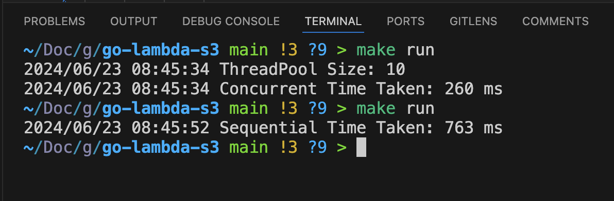

## go-lambda-s3

Demonstration of File Based trigger of AWS lambda and concurrent processing using ThreadPool in Golang.

## Tech stack

- _Language_: **Go**
- _Database_: **Mysql (AWS RDS)**
- _Deployment_: **AWS Lambda**

## Results

